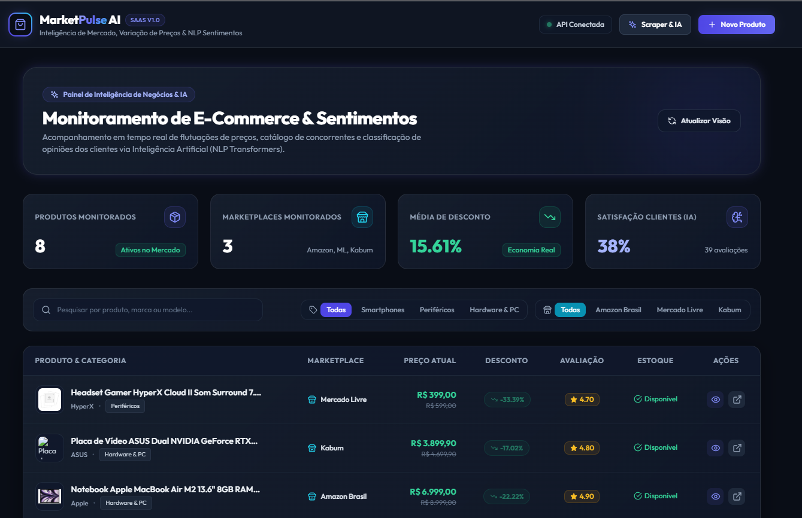
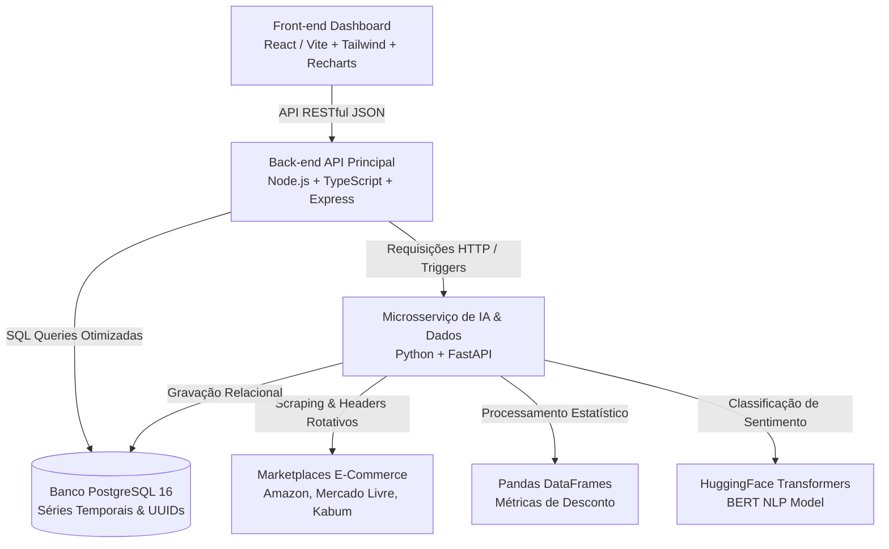

<div align="center">
  <h1> MarketPulse AI</h1>
  <p><strong>SaaS de Inteligência de Mercado & Monitoramento de E-Commerce</strong></p>

  <p>
    
    
    
    
    
    
    
  </p>
</div>

---

Plataforma completa de Inteligência de Negócios e E-Commerce orientada a dados e IA. Combina **Web Scraping**, **Modelagem Estatística de Flutuação de Preços** com **Pandas** e **Classificação de Sentimentos em Avaliações de Consumidores** usando **Modelos de Linguagem NLP (Transformers / BERT)**.

---

##  Visão Geral da Solução

O **MarketPulse AI** monitora os principais marketplaces (Amazon Brasil, Mercado Livre, Kabum, Magalu) e fornece dashboards executivos em tempo real. A plataforma centraliza a análise da concorrência, identificando tendências de preços e avaliando a percepção do consumidor sobre os produtos através de Inteligência Artificial.

> `

---

##  Principais Funcionalidades

-  **Alertas de Ofertas Relâmpago e Descontos Reais:** Cálculo de variação percentual de preços (\(\Delta P\)) com base no histórico temporal (não apenas o desconto anunciado pela loja).
-  **Raio-X de Sentimento dos Consumidores (IA):** Análise contextual de comentários via modelos NLP treinados em Português (classificando em `POSITIVE`, `NEUTRAL`, `NEGATIVE` e calculando % de confiança).
-  **Ingestão Contínua & Web Scraping Resiliente:** Monitoramento automatizado de URLs com rotação de cabeçalhos e estratégias de *Exponential Backoff*.
-  **Cadastro Manual Intuitivo:** Permite adicionar novos produtos diretamente pela interface com disparo automático do pipeline de IA.
-  **Interface Responsiva & Glassmorphism:** Dashboard moderno em Dark Mode com gráficos interativos de séries temporais.

---

##  Arquitetura do Sistema

A aplicação foi projetada utilizando microsserviços para separar o processamento pesado de IA da API transacional.



---

##  Tecnologias Utilizadas

**Frontend:**
- React 18 + TypeScript + Vite
- Tailwind CSS (Estilização + Glassmorphism)
- Recharts (Gráficos)
- Lucide React (Ícones)
- Axios (Requisições HTTP)

**Backend:**
- Node.js + TypeScript
- Express.js (API RESTful)
- `pg` (PostgreSQL Client)

**Microserviço de IA:**
- Python 3.10+
- FastAPI
- Pandas & NumPy (Análise Estatística)
- HuggingFace Transformers (NLP Sentimento)
- BeautifulSoup / Selenium (Web Scraping)

**Infraestrutura & Banco de Dados:**
- PostgreSQL 16
- Docker & Docker Compose
- pgAdmin (Gestão do DB)

---

##  Estrutura do Monorepo

```text
market-pulse-ai/
├── frontend/                 # Interface React / Vite (Dashboards e UI)
├── backend/                  # API RESTful Node.js (Regras de Negócio e Roteamento)
├── ai-services/              # Microsserviço Python (Web Scraper, Pandas e NLP)
├── database/                 # Arquivos SQL (Init, Migrations, Seeds)
├── .github/workflows/        # Pipeline de CI/CD (GitHub Actions)
├── docker-compose.yml        # Orquestração local do Banco de Dados
├── .env.example              # Modelo de variáveis de ambiente
└── README.md                 # Documentação principal
```

---

##  Destaques Técnicos de Segurança & Integridade de Dados

- **Prevenção de SQL Injection:** 100% das consultas SQL utilizam parâmetros preparados (`$1, $2`).
- **Validação e Resiliência:** Suporte duplo no repositório de dados para busca por **UUID relacional** e por **Nome Textual** com sanitização via Regex.
- **Integridade Relacional no Banco:** Uso de restrições `CHECK` em notas (1.0 a 5.0), preços não negativos (`price >= 0`) e deleções em cascata (`ON DELETE CASCADE`).
- **Web Scraping Resiliente:** Rotação de `User-Agents` e tratamento de exceções para lidar com bloqueios.
- **Tratamento de Erros:** Middlewares globais que ocultam *stack traces* em produção para evitar vazamento de dados da infraestrutura.

---

##  Como Executar a Aplicação Localmente

### Pré-requisitos
Certifique-se de ter instalado em sua máquina:
- [Docker & Docker Compose](https://www.docker.com/)
- [Node.js v20+](https://nodejs.org/)
- [Python 3.10+](https://www.python.org/) e `pip`
- Git

### 1️ Clonar o Repositório e Configurar Variáveis de Ambiente

```bash
git clone https://github.com/SEU_USUARIO/projeto-saas.git
cd projeto-saas

# Copie o arquivo de exemplo para o .env real
cp .env.example .env
```
*(No Windows PowerShell, use `Copy-Item .env.example .env`)*

Revise o arquivo `.env` para garantir que as portas e senhas estão corretas para o seu ambiente.

### 2️ Subir o Banco de Dados PostgreSQL (Docker)

```bash
docker-compose up -d
```
> O banco rodará na porta `5433` e a interface do pgAdmin em `http://localhost:5050` (Email: `admin@admin.com` / Senha: `admin_secret_key`).

### 3️⃣ Executar o Microsserviço de IA (Python)

Abra um novo terminal e execute:
```bash
cd ai-services
python -m venv venv

# Ativar o ambiente virtual:
# No Windows:
.\venv\Scripts\activate
# No Linux/Mac:
source venv/bin/activate

pip install -r requirements.txt
python run_pipeline.py
```
> *(Nota: Ao rodar pela primeira vez, o Python baixará o modelo NLP do HuggingFace, o que pode levar alguns minutos dependendo da conexão).*

### 4️ Executar a API RESTful (Node.js + TypeScript)

Em um novo terminal:
```bash
cd backend
npm install
npm run dev
```
> A API estará disponível em `http://localhost:3000/api/v1/health`.

### 5️ Executar a Interface Web (React)

Em um novo terminal:
```bash
cd frontend
npm install
npm run dev
```
> Acesse o Dashboard no navegador em: **[http://localhost:5173](http://localhost:5173)**

---

##  Endpoints Principais da API (`/api/v1`)

| Método | Rota | Descrição |
| :--- | :--- | :--- |
| `GET` | `/health` | Verifica o status do servidor e a conexão com o PostgreSQL. |
| `GET` | `/products` | Lista o catálogo com filtros por categoria, concorrente ou busca textual. |
| `POST`| `/products` | Cadastra um produto manualmente via formulário. |
| `GET` | `/products/:id/history` | Retorna a série temporal de preços para os gráficos. |
| `GET` | `/analytics/dashboard` | Retorna o resumo executivo de KPIs e distribuição de sentimentos. |
| `POST`| `/pipeline/trigger` | Dispara o pipeline de coleta e inteligência de IA via HTTP. |

---

## Como Contribuir

1. Faça um **Fork** do projeto
2. Crie uma branch para sua feature (`git checkout -b feature/MinhaNovaFeature`)
3. Faça o commit das suas alterações (`git commit -m 'feat: Adicionando uma nova feature'`)
4. Faça o push para a branch (`git push origin feature/MinhaNovaFeature`)
5. Abra um **Pull Request**

---

##  Licença

Este projeto está sob a licença MIT. Veja o arquivo [LICENSE](LICENSE) para mais detalhes.

---

##  Autor

Desenvolvido por **Maria Eduarda Teixeira Mendes/dudamav14** - Projeto criado seguindo as melhores práticas de Engenharia de Software, Arquitetura Limpa, Engenharia de Dados e Inteligência Artificial.

[](https://www.linkedin.com/in/mariaeduardateixeiramendes/)
[](https://github.com/dudamav14)
